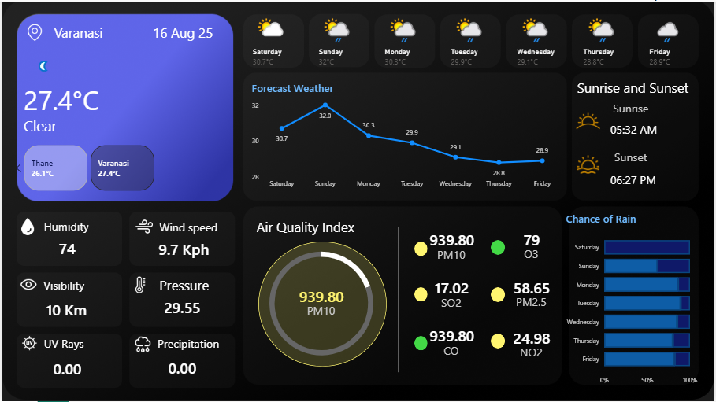

# Weather & Air Quality Dashboard 🌦️

This is a Power BI dashboard that uses data from [WeatherAPI](https://www.weatherapi.com/) to show:
- Forecasts for 5 Indian cities (Bangalore, Thane, Guwahati, Pondicherry, Varanasi)
- Air Quality Index (PM10, PM2.5, CO, NO2, SO2, O3)
- Sunrise & Sunset times
- Rain chances, humidity, wind speed, UV rays, etc.

## Preview 📊

## Files 📂
- `Weather.pbix` → Power BI file
- `weather.png` → Dashboard preview

